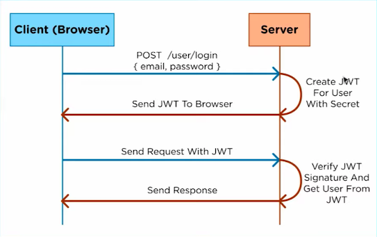
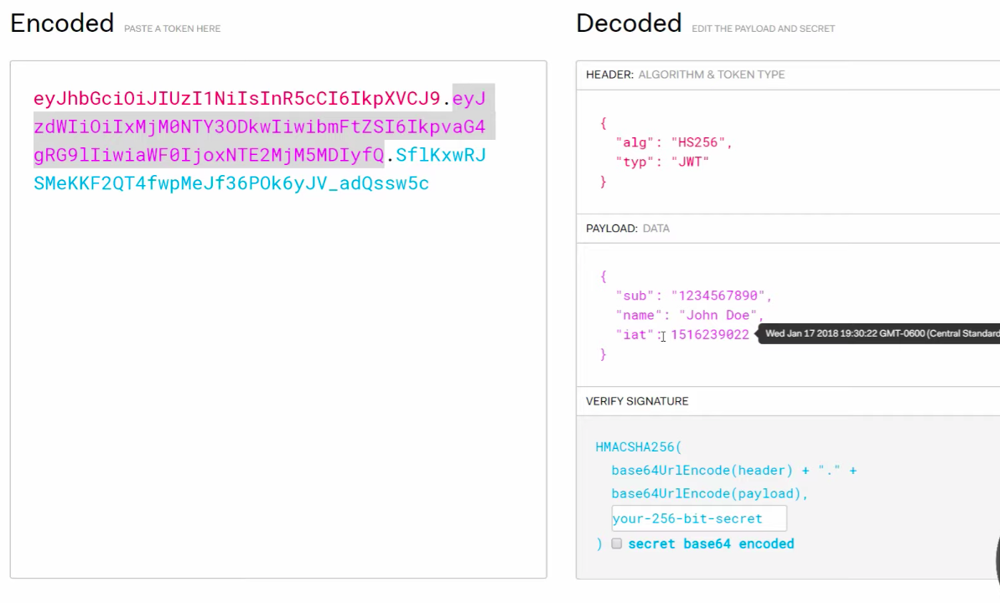
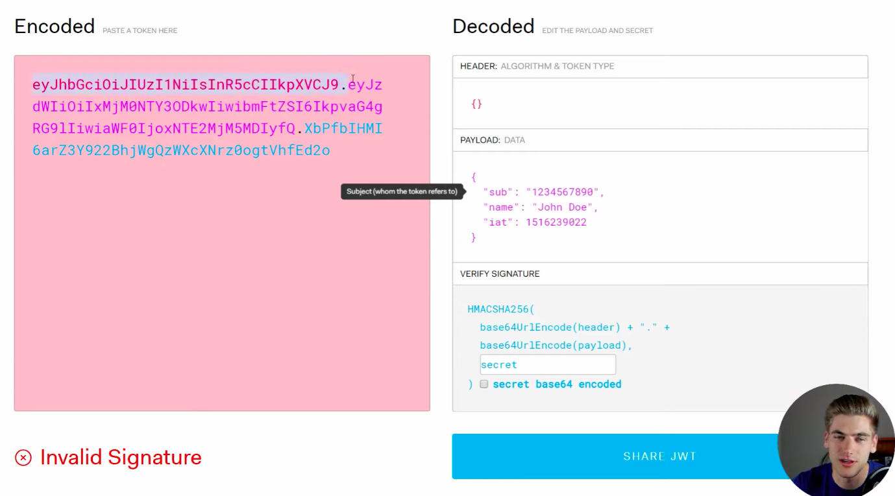
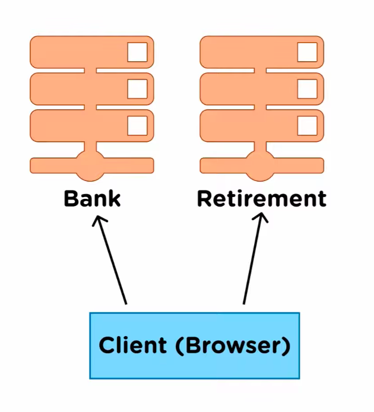
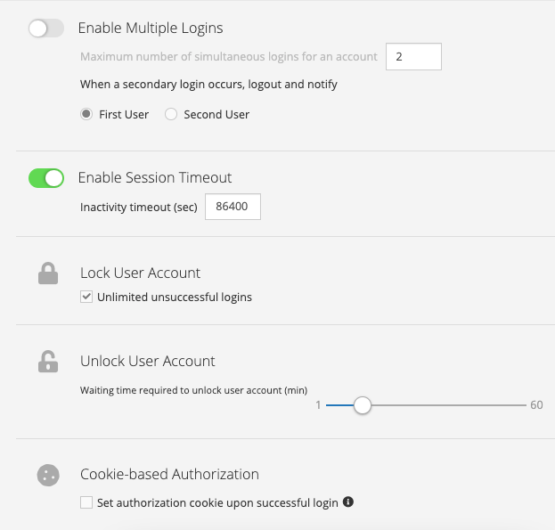
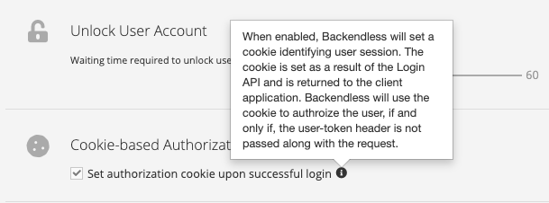

# TripSNS

## 1. < 유저에게 더 이로운 > 인증 방식 찾기 Authentification : sessionID vs. J son W eb T oken
 

[ 출처 : 유투브 ](https://www.youtube.com/watch?v=7Q17ubqLfaM) 

### 1). 세션 방식 인증

1. 클라이언트가 이메일 / 패스워드 전달
2. 서버가 DB나 RAM에 Session ID 저장 후 Cookie에 Session ID 담아서 전달
3. 클라이언트가 Cookie와 함께, 서버에 작업 요청
4. 서버는 DB에 그 Cookie에 담겨 온, SessionID가 일치하는지, 만료되지 않았는지 확인 => i/o 작업 => 디비/램 조회
5. 유효하면 서버가 요청한 작업 수행
 
 

### 2). 토큰 인증 방식, JWT 

__HEADER__ 
* token 종류
* 인증 시 사용할 알고리즘 : header + payload + 서버 사이드 비밀 키 -> __알고리즘__ -> VERIFICATION SIGNATURE 

__PAYLOAD__ 
* user info.
* 클라이언트 측에서 보관할 유저 정보
* 이메일, 이름, 토큰 만료 날짜 등등
* 중요 : 이제 세션 아이디를 서버 사이드에서 저장하지 않아도 된다. 서버 사이드에는, 여러 서버가 공유할, 알고리즘에 넣을 키만 공유하고 있으면 된다. 
  
__VERIFICATION SIGNATURE__ 

* HEADER + PAYLOAD + SECRET 🔑 -> ALGORITHM => __"매칭되어야 하는 결과"__
* 클라이언트 측에서 토큰으로 들고 있는 user info를 서버에 유효한 요청없이, 클라이언트 사이드에서 임의로 바꿀 수 없음.

 

### 그럼 jwt를 쓰면 여러 서버를 넘나드는 인증이 가능한지? 

* 예를 들어, 한 회원에 대하여,두 개의 서버가 연루된 작업을 처리할 때, 서버가 유효한 세션ID를 항상 가지고 있어야, 귀찮은 로그인 과정없이, 매끄러운 연동이 가능. 하지만, 서버 사이에 계속해서 세션 아이디를 보관해야함. => 비효율 !!
 

### jwt는 서버가 할 일 줄어들어, 현실적으로 이 문제 해결 !! -> 유저가 들고 있어라 !!! ?
 

* 여러 서버끼리는 sessionID를 계속해서 주고 받고 업데이트 할 필요가 없다.
* 서버 사이드들에서는 공유된 키만 가지고 있으면 된다. 
* 클라이언트가 쿠키에 자신의 유저 인포를 저장해놓고 들고 다닌다.
  * 그러면서 임의로 변형시킬 수도 없다.
  * 아이디, 토큰 만료 날짜, 이름 등 임의로 변경 불가능
* 유저는 귀찮게 두 번 로그인 할 필요가 없고, 서버는 편의를 제공하면서도, 안전한 로그인을 제공할 수 있다.

## 토큰 및 세션 인증에서 고려할 것들

### __1. 서버 단의 보안 조치 : 서버 단에서 다음과 같은 세션 설정을 해놓았을 수 있다.__ 
  > 별도로 판단을 위한 자료를 저장해놓고, 유효성 검토에 사용하는 경우가 많다.
  * 동시 접속 한도
    * 구현 원리
      * 세션 방식 : __임시 DB를 제작__ 해두고 그 곳에 __id와 ip를 저장__ 후, 만약 __그 아이디로 접속이 시도__ 된다면 그 아이디의 __ip를 가져와 세션을 무효화__
      * 토큰 방식 : 
        * 1. IAT(Issued AT)를 페이로드에 포함하여 발급.
        * 2. User가 마지막으로 로그인한 시간을 유저 프로필 같은 별도의 장소에 보관.
        * 3. 토큰 체크를 할 때, IAT가 마지막으로 로그인한 시간과 같거나 더 늦은 시각일 때만 유효로 판단.
  * 세션의 타임 아웃 - 토큰 및 세션의 만료
    * payload에 __EAT(Expires AT)__ 을 포함
    * 해당 시간이 지나면 토큰 무효화
  * 로그인 시도 5회 제한 - 해킹 방지를 위한
  * 특정 계정 서버에서 금지 시킴 
   
### __2. Cookie__ 
 
  
   

  * https request때 마다, user-token을 헤더에 넣는 것을 안 하고 싶다면?
    * 로그인 시 쿠키를 서버로 부터 받아, 대신 이용할 것. 