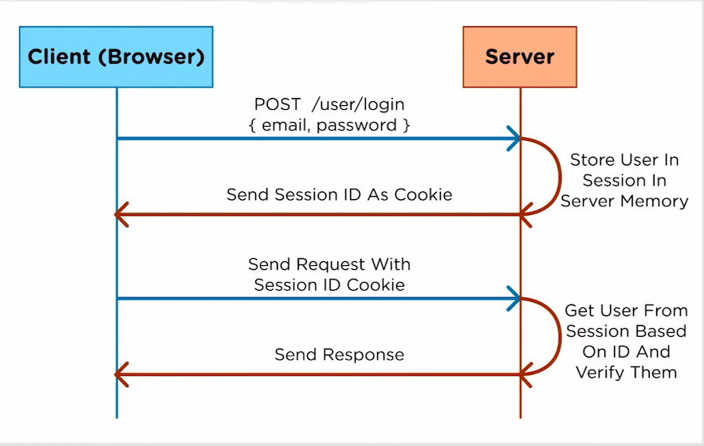

# TripSNS

## 1. 유저에게 더 이로운 인증 방식 찾기 Authentification : sessionID vs. J son W eb T oken

[ sessionID vs. J.W.T 유투브 리서치 ](https://www.youtube.com/watch?v=7Q17ubqLfaM)

### 1). 세션 방식 인증

1. 클라이언트가 이메일 / 패스워드 전달
2. 서버가 DB나 RAM에 Session ID 저장 후 Cookie에 Session ID 담아서 전달
3. 클라이언트가 Cookie와 함께, 서버에 작업 요청
4. 서버는 DB에 그 Cookie에 담겨 온, SessionID가 일치하는지, 만료되지 않았는지 확인 => i/o 작업 => 디비/램 조회
5. 유효하면 서버가 요청한 작업 수행
 
 

### 2). 토큰 인증 방식, JWT 

HEADER 
* token 종류
* 인증 시 사용할 알고리즘 : header + payload + 서버 사이드 비밀 키 -> __알고리즘__ -> VERIFICATION SIGNATURE 

PAYLOAD 
* user info.
* 클라이언트 측에서 보관할 유저 정보
* 이메일, 이름, 토큰 만료 날짜 등등
* 중요 : 이제 세션 아이디를 서버 사이드에서 저장하지 않아도 된다. 서버 사이드에는, 여러 서버가 공유할, 알고리즘에 넣을 키만 공유하고 있으면 된다. 
  
VERIFICATION SIGNATURE 

* HEADER + PAYLOAD + SECRET 🔑 -> ALGORITHM => __"매칭되어야 하는 결과"__
* 클라이언트 측에서 토큰으로 들고 있는 user info를 서버에 유효한 요청없이, 클라이언트 사이드에서 임의로 바꿀 수 없음.

 

##@ 그럼 jwt를 쓰면 여러 서버를 넘나드는 인증이 가능한지? 

* 예를 들어, 한 회원에 대하여,두 개의 서버가 연루된 작업을 처리할 때, 서버가 유효한 세션ID를 항상 가지고 있어야, 귀찮은 로그인 과정없이, 매끄러운 연동이 가능. 하지만, 서버 사이에 계속해서 세션 아이디를 보관해야함. => 비효율 !!
 

### jwt는 서버가 할 일 줄어들어, 현실적으로 이 문제 해결 !! -> 유저가 들고 있어라 !!! ?
 

* 여러 서버끼리는 sessionID를 계속해서 주고 받고 업데이트 할 필요가 없다.
* 서버 사이드들에서는 공유된 키만 가지고 있으면 된다. 
* 클라이언트가 쿠키에 자신의 유저 인포를 저장해놓고 들고 다닌다.
  * 그러면서 임의로 변형시킬 수도 없다.
  * 아이디, 토큰 만료 날짜, 이름 등 임의로 변경 불가능
* !! 유저는 귀찮게 두 번 로그인 할 필요가 없고, 서버는 편의를 제공하면서도, 안전한 로그인을 제공할 수 있다.